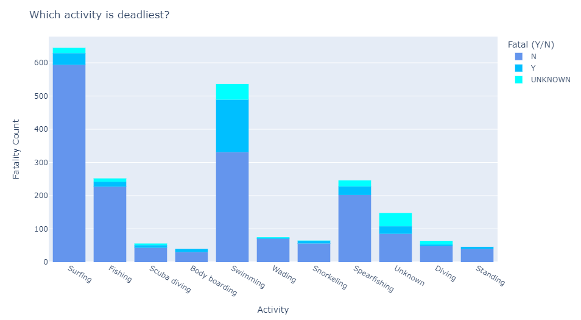
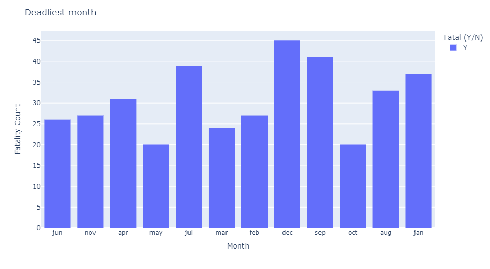
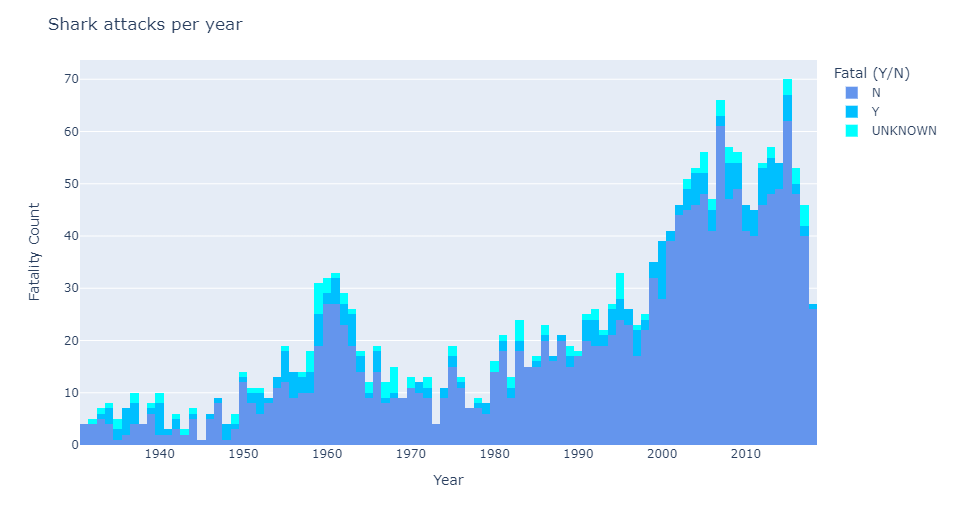
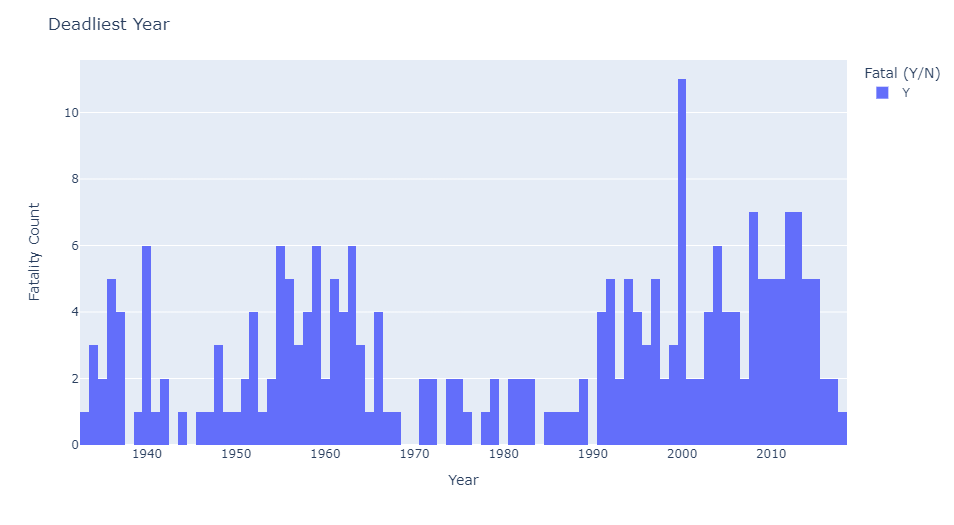
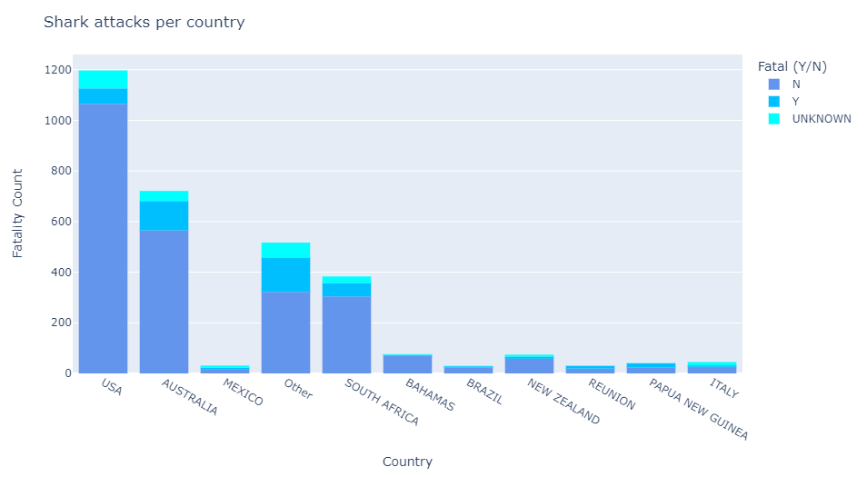

# Cleaning and analysing Shark attacks dataset
## Selma Laarabi
## 1.Introduction
- This readMe describes the process of cleaning dataset for shark attacks, as well as analysing the data and proposing hypothesis
- In this analysis we are using 2 Jupyter NoteBooks, one for performing the cleaning and another one for visualization and analysis
## 2.Describing the Data set
The data set used in this exercise, contains a list of incidents reported as shark attacks, accross the globe, this data set also provides information about the  location of the incident, information about the victims, as well as various other data,
From first observation we do notice that the data set is somehow dirty and requires lots of cleaning and normalization.
## 3.The cleaning process
After importing the csv into the dataframe, the first step was to explore the data.
Looking at the columns, we started by removing empty and duplicated ones (ie unnamed 22, unnamed 23) as well as columns that are irrelevant to our analysis like "PDF" and "Href".
Also as part of the cleaning, just by running a duplication check we removed 19K lines of duplicated and null data.
we also made sure to correct some columns name like "sex" and "species"
now our columns are reduced enough to proceed with the data cleaning.

### Data Cleaning
The data cleaning involved:
- adding specific fields for months to cover months and years,
- grouping and normalizing some categorie columns to reduce the number of unique categories.(ie Boat and Boating),
- filling missing values depending on the column type,
you can see more about the cleaning process in the "Shark_attacks.ipynb"
## 4. Analysing the clean data set
Now that we have our dat set clean and ready for analysis, it's time to start formulating some hypothesis
- Do shark descriminate by gender?
- Are there certain activities that attrack sharks?
- Do shark perceive time? do they have a favorite month?
- Which location to avoid if I don't want to be attacked by a shark?
- 
  Let's dive in!
### - Do shark descriminate by gender?
After looking at the distribution of fatality by gender within our Dataframe, it looks like males get attacked more than females however, Females have 16% fatality rate Vs 13% for men (Shark attacks are deadlier for females)

* if you're a woman and reading this, if you see a fin swim back to the shore..*

### - Do sharks get angry when provoked?
it looks like 80% of the attacks were not provoked, but when provoked it can be quiet deadly.  
In provoked accidents 14% are fatal vs 2% not fatal.

### - Are there certain activities that attrack sharks?
There are so many activities we can do at sea, we can be surfing, swimming, snorkeling, or fishing but which activity is less safe, if we don't like being eaten by sharks?
to no one's surprise surfers get attacked the most but the good news is that they have 94,6% chance of making it back home alive,
however, swimmers are easier prey to sharks with a fatality rate of 29,47% (as opposed to surfing Only 5.42%)
* Surfboards save lives *

### - Do shark perceive time? do they have a favorite month?
let's look at when sharks have more appetite,
we observed that sharks attack more in July with May being the slowest month for theme

Now let's look at the deadliset month:
after we select only the attacks that resulted in a fatality, we observe that even if July has the most attacks, December is the most fatal month
(Plan your holidays carefully!)

After limiting the years starting from 1930,we observe that 2015 is the year with the most number of attacks,
also we notice that the number of attacks is increasing over time,
however this could be due to the increase number of attacks that get reported,(or maybe surfing got popular with the years)

Now let's look at the deadliset year: 2000 was the deadliest year
(what makes that year so special for sharks? a google search suggest that Australia held Summer Olympics!)

### Where is the deadliest shark?
we can see that USA has the most number of attacks followed by Australia and South Africa
but Australia has the  deadliest sharks

## 5. So what are our main finding from this analysis?

- Sharks do not descriminate by gender, they attack all people equally.
- Even if 80% of the attacks were not provoked, sharks get deadlier when provoked.
- Sharks are really attracted to surfers, however it's the swimmers who have less chances of surviving an attack.
- Plan your holidays carrefully, sharks' favorite month to attack is july, but they get deadlier in december (Christmas holidays in the mountains!) 
- The deadliest shark are from Australia, but American sharks are at the top of the attacking billboard.

